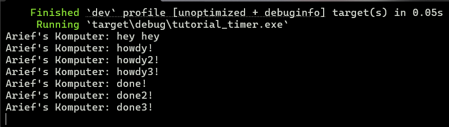

Nama: Arief Ridzki Darmawan
NPM: 2306210115
Kelas: A

## 1.2


"hey hey" di print pertama walaupun berada setelah ```spawner.spawn``` disebabkan karena statement println tersebut merupakan statement synchronous biasa pada main, yang akan secara langsung dieksekusi setelah cargo run. Sementara, "howdy!" dan "done!" berada pada block async, yang tidak di run sebelum disuruh oleh executor. Saat block async di run, "howdy!" akan di print terlebih dahulu dan "done!" akan di print 2 detik setelahnya sesuai dengan durasi yang ada di kode.

## 1.3
* Tanpa ```drop(spawner)```

(Kursor masih kedap-kedip dan program terus berjalan)

* Dengan ```drop(spawner)```

(Program selesai)

```drop(spawner)``` berfungsi untuk mematikan spawner. Jika tidak dimatikan, executor tetap menunggu untuk task-task selanjutnya selamanya.

Alasan mengapa "done!" dan "done2!" bertukar tempat pada output kedua adalah karena race condition, dan tidak dipengaruhi oleh ```drop(spawner)```. Race condition dapat terjadi jika beberapa objek di spawn secara parallel, dan waktu eksekusi yang mirip tidak dapat menjamin urutan eksekusi.